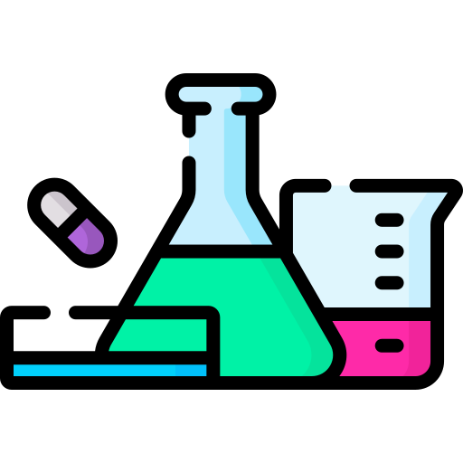
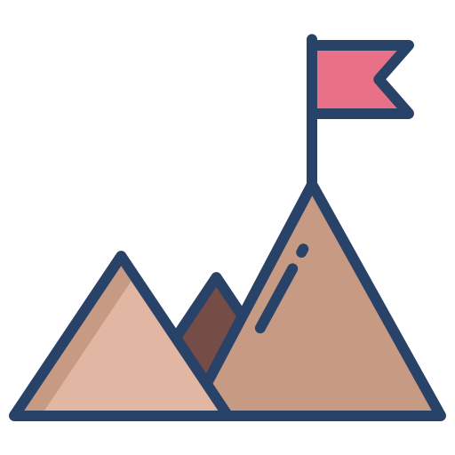

#  Github Stats
   
  

    
    
     
    <b>Note:</b> Top languages is only a metric of the languages my public code consists of and doesn't reflect experience or skill level.
  

----

#  My Projects
##  Deep Learning:

  
 Click to expand 

📌 [**Jul 2022 - Aug 2022**]: Faster R-CNN Research and Implementation
  * Code and research Faster R-CNN algorithm.
  * [Github Repo](https://github.com/hoang1007/faster-rcnn.git)

--------
##  Software:

  
Click to expand

📌 [**Sep 2021**]:
  * Build a Discord Bot which playing music and providing memes.
  * [Github Repo](https://github.com/hoang1007/gideon.git)
  
📌 [**Oct 2022**]:
  * Build mobile application with React Native which tracking user's expenses.
  * [Github Repo](https://github.com/hoang1007/room-expense-tracker.git)

--------

#  My Assignments

  
Click to expand

📌 [**May 2021 - Advanced Programming**]:
  * A Snake Game with autoplay using SDL2.
  * [Github Repo](https://github.com/hoang1007/Snake.git)

📌 [**Oct 2021 - Object Oriented Programming**]:
  * A Dictionary App which can translate from speech, image using JavaFx
  * [Github Repo](https://github.com/hoang1007/dictionary-oop/tree/graphic)

📌 [**Dec 2021 - Object Oriented Programming**]:
  * A Bomberman Game using JavaFx
  * [Github Repo](https://github.com/hoang1007/bomberman.git)

#  Competitions

  
Click to expand

📌 [**Jul 2022 - Sep 2022**]:
  * 5th at Air Quality Forecasting Challenge AI4VN.
  * [Github Repo](https://github.com/hoang1007/air-quality-forecasting/tree/hoangv3)

#  Connect with me

	
	
	
	
	

